# Konfigurasi-Web-Server-mengunakan-Nginx-pada-Debian-10
8 Oktober 2025  
  
# Pendahuluan
  Nginx merupakan salah satu web server open-source yang berfungsi untuk melayani request dari klien melalui protokol HTTP maupun HTTPS. Nginx dikenal karena efisiensinya dalam menangani traffic yang tinggi dan resource yang relatif rendah dibandingkan Apache2.  
  
# Langkah konfigurasi  
  1. Langkah pertama adalah melakukan installasi package Nginx.  
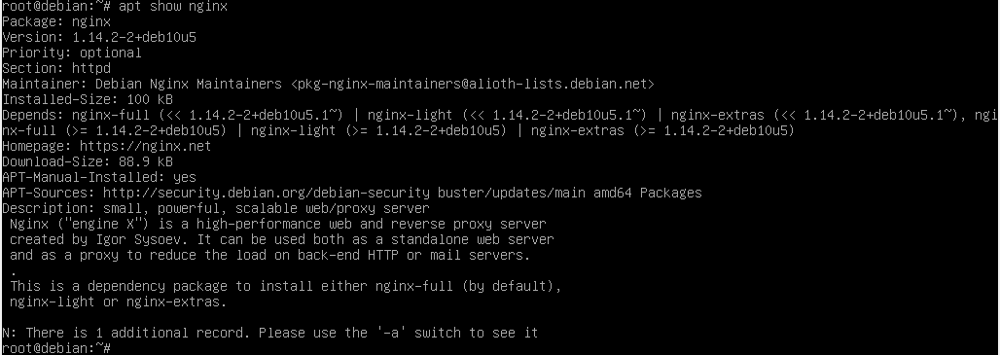  
  2. Sekarang kita perlu mengatur static IP pada interface agar server dapat di akses oleh client di LAN.  
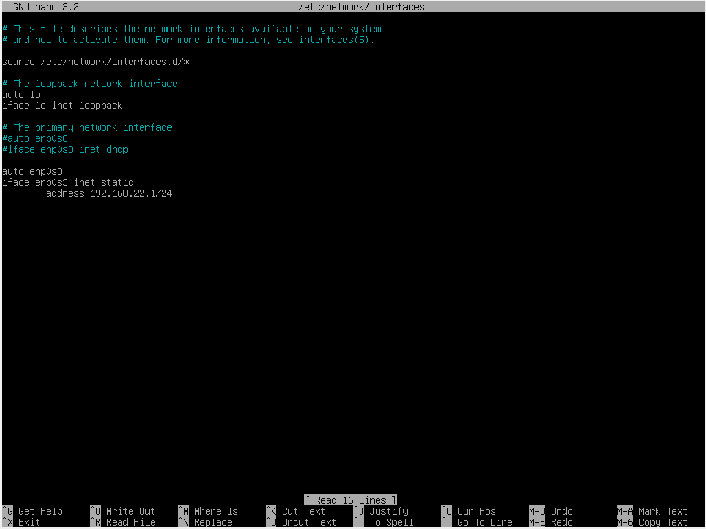  
  3. Jika sudah jangan lupa untuk restart networking service dan lihat apakah ip nya sudah terpasang.  
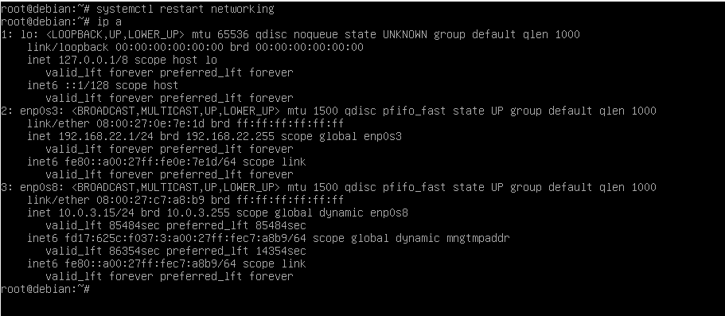  
  4. Sebelum menaljutkan ke proses berikutnya, jika kita punya Apache2 dan masih berjalan, matikan dulu servicenya agar tidak tabrakan nantinya. Pastikan service apache2 sudah benar-benar berhenti.  
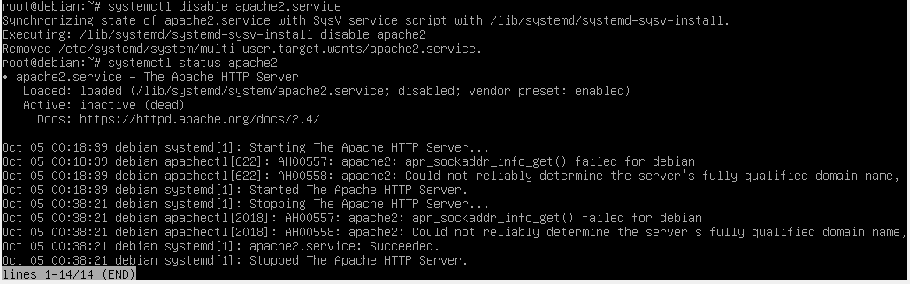  
  5. Selanjutnya kita konfigurasi static ini juga untuk clientnya agar satu segmen dengan server.  
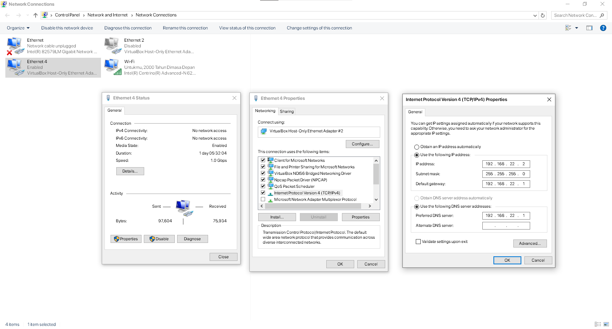  
  6. Jika sudah, cek service nginx dan pastikan sudah berjalan. Lalu di web browser client arahkan ke IP server, jika berhasil browser akan menampilkan default page nginx.  
  
  
  7. Selanjutnya, buat direktori baru untuk index.html kita di **/var/www**.

         mkdir /var/www/penguin
  8. Masuk ke direktori itu lalu buat file **index.html**. Tambahkan kode HTML yang simple sesuai keinginan. Jika sudah jangan lupa save.  
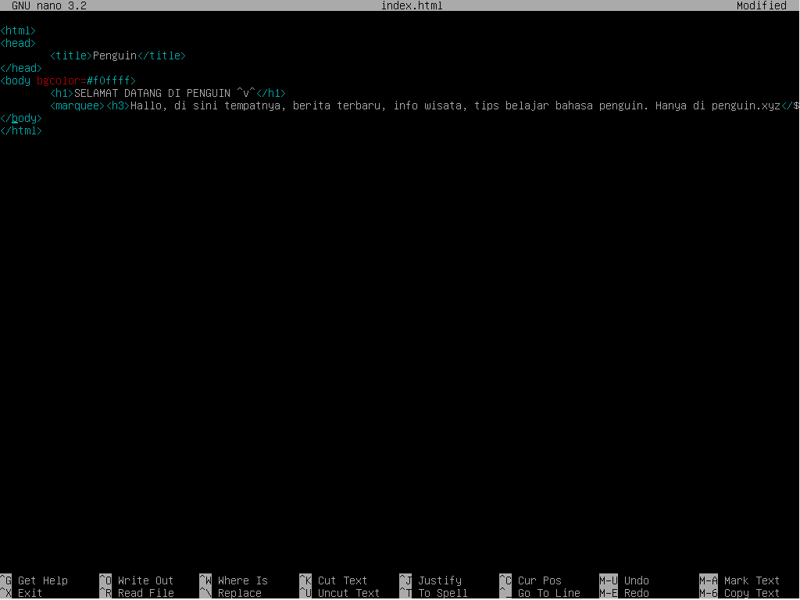  
  9. Selanjutnya masuk ke direktori **sites-available**, lalu buat file konfigurasi **penguin.conf**, lalu ubah isinya menjadi seperti berikut.  
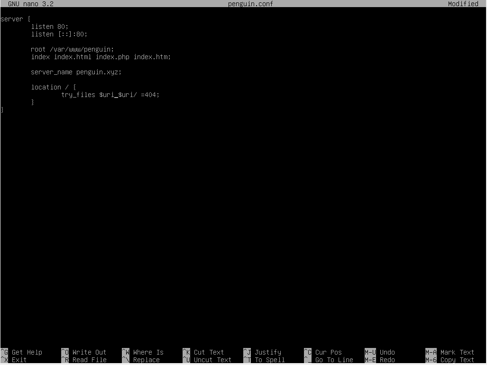  
     **listen 80;**  
       Artinya Nginx akan mendengarkan request dari client di port 80, yaitu port default untuk protokol HTTP.  
     **server_name penguin.local;**  
       Ini menentukan nama domain yang akan dikenali oleh server.  
     **root /var/www/penguin;**  
       Ini menentukan lokasi folder tempat file web kamu disimpan (dokumen HTML, CSS, gambar, dll).  
     **index index.html;**  
     Ini menentukan file utama (default) yang bakal ditampilkan kalau user buka situs tanpa nentuin nama file.  
     **location / { ... }**  
     Bagian ini ngatur gimana Nginx merespons permintaan dari jalur tertentu (dalam hal ini /, artinya seluruh situs).  
     Contoh: ```try_files $uri $uri/ =404;```  
      Nginx bakal coba nyari file sesuai permintaan user ($uri = path yang diminta). Kalau gak ketemu, dia coba cari folder ($uri/). Kalau dua-duanya gak ada, balikin error 404 (Not Found).  
  11. Jika sudah jangan lupa save lalu aktifkan server block dengan membuat symlink ke direktori **sites-enabled**.  
  
      Perintah ini membuat symlink(shortcut) dari file konfigurasi yang ada di folder /etc/nginx/sites-available/ ke folder /etc/nginx/sites-enabled/.  
  13. Jangan lupa hapus konfigurasi default agar tidak ada konflik, backup file default jika perlu.  
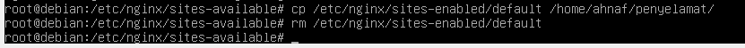  
  14. Periksa sintaks konfigurasi.  
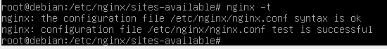  
      Jika muncul pesan syntax is ok dan test is successful, maka konfigurasi telah benar.
  15. Selanjutnya restart nginx service dengan systemctl.  
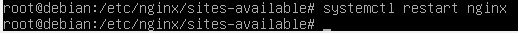  
  16. Jika sudah buka web browser pada client, lalu akses alamat IP atau domain server Debian. Jika berhasil halaman web dari isi index.html akan muncul.  
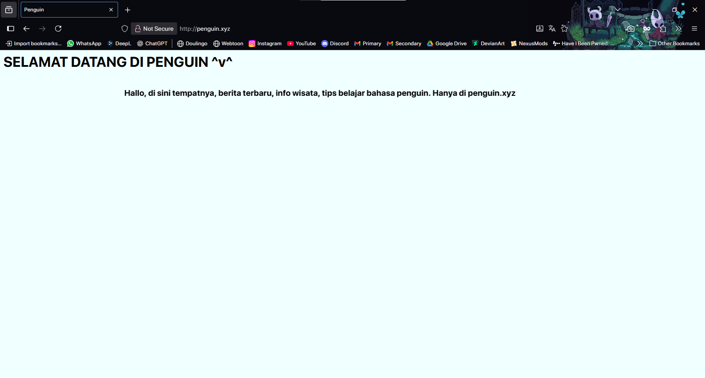

# Kesimpulan
  Dari hasil konfigurasi yang telah dilakukan, dapat disimpulkan bahwa Nginx merupakan web server yang ringan, cepat, serta mudah dikonfigurasi untuk kebutuhan hosting website sederhana maupun kompleks.  
  
